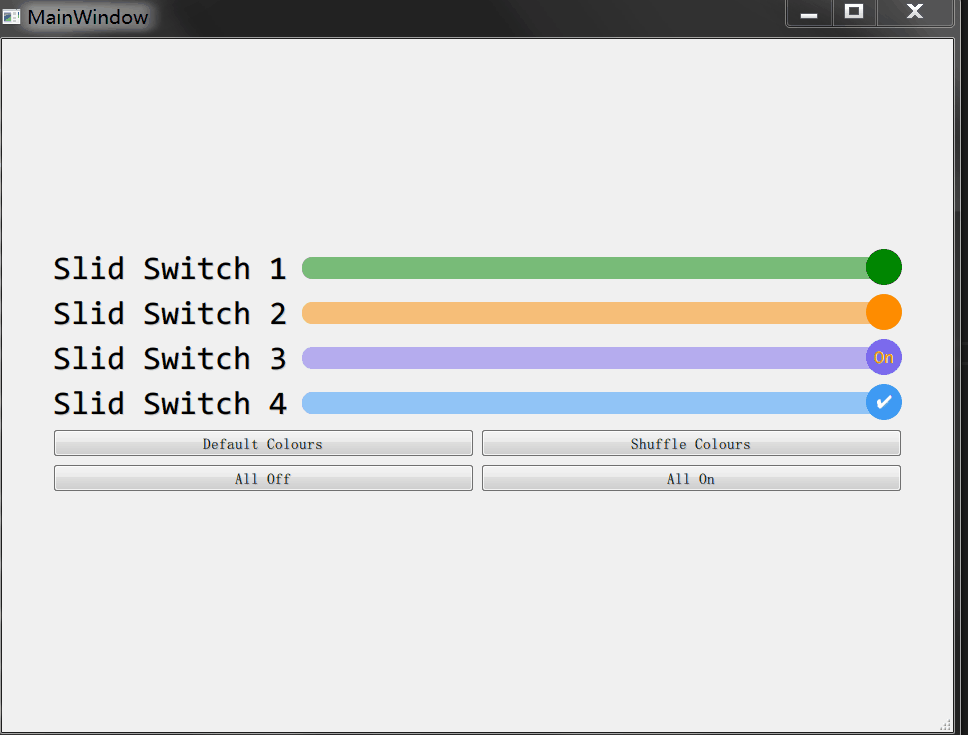

# pyqt_slide_switch
A mobile OS style slide switch (Android, iOS) in pyqt5.

Found myself one day wanting a switch like Android's while doing a GUI in pyqt5. Found a usable one, but much could be imporved. Thus this project.

The original C++ code was posted by IMAN4K:
https://stackoverflow.com/a/38102598

The original Python version was ported by Stefan Scherfke:
https://stackoverflow.com/a/51825815

